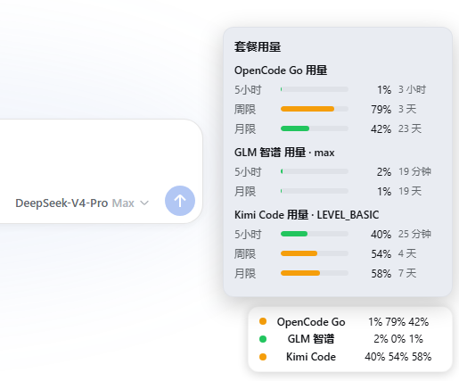

# dsh-plan-usage

在 DeepSeek Harness 的 Web 对话框**右下角**显示套餐用量角标，实时展示每个套餐的三个用量窗口：

- **5小时**（滚动窗口）
- **周限**
- **月限**

当前支持四个套餐（渠道）：**OpenCode Go**（5小时 $12 滚动 / 周 $30 / 月 $60）、**GLM Z.AI**（GLM Coding Plan 国际版）、**GLM 智谱**（GLM Coding Plan 国内版，5小时 token 窗口 / 周 token 窗口 / 月 MCP 工具额度）与 **Kimi Code**（Kimi 会员套餐额度：5小时频限窗口 / 7 天周限；月度会员额度可经可选的 kimi-auth Cookie 增强）。

胶囊为**多行**样式：每个套餐一行，依次列出 5小时/周限/月限 三个窗口的百分比（缺失的窗口按 0% 计，如 Z.AI 套餐无周限、Kimi Code 未配 Cookie 时无月限）；每行前一颗状态圆点按该套餐最差窗口分级（<50% 绿 / 50–89% 黄 / ≥90% 红），例如：

```
OpenCode Go 0% 79% 42%
GLM Z.AI 1% 0% 1%
GLM 智谱 请设置 Key
Kimi Code 12% 6%
```

胶囊外形自适应：只有一行时保持圆弧胶囊，多行时自动改为圆角矩形。

点击胶囊展开面板，面板按套餐分区，每区展示三个窗口的进度条与重置倒计时，每 60 秒自动刷新。



## 配置

装好后，在 **设置 → 插件 → 插件配置** 里会出现「套餐用量」卡片（默认折叠，点击标题栏展开/收起；外观与内置的「终端 / Agent 循环 / 网页搜索」卡片保持一致——同样的折叠头部、未保存徽标、底部「放弃修改 / 保存 / 保存中…」按钮与配色）：

- **启用套餐用量角标**：全局开关，关闭后右下角角标不再显示（默认开启）。
- 每个套餐一个区块（当前为 **OpenCode Go**、**GLM Z.AI**、**GLM 智谱** 与 **Kimi Code**，GLM 两个渠道互相独立）：
  - **启用 \<套餐\> 用量角标**：该套餐的开关，关闭后该套餐不再取数、不再显示。
  - **\<套餐\> API Key（可选）**：该套餐专用的 API Key 输入框（write-only 密钥，只显示「已配置 / 未配置」，可一键清除）。
  - **Kimi Code kimi-auth Cookie（可选）**：Kimi 专属，用于增强显示月度会员额度（见下方 Kimi 说明）。

每个套餐的 API Key 解析优先级相同：

1. 插件配置卡片里填入的该套餐 API Key（最高）；
2. 「设置 → 模型」里保存的该套餐凭据；
3. 环境变量（OpenCode Go：`OPENCODE_GO_API_KEY` / `OPENCODE_API_KEY`；GLM Z.AI：`ZAI_API_KEY` / `Z_AI_API_KEY` / `GLM_ZAI_API_KEY`；GLM 智谱：`ZHIPU_API_KEY` / `ZHIPUAI_API_KEY` / `GLM_API_KEY` / `BIGMODEL_API_KEY`；Kimi Code：`KIMI_CODE_API_KEY` / `KIMI_API_KEY`）。

卡片里的 Key 留空时回退到上面的 2/3；如果两边都没设置，该套餐在胶囊与面板中会提示配置。

### GLM 说明

GLM 有两个渠道，各自独立开关与 API Key：

- **GLM Z.AI（国际版）**：`https://api.z.ai/api/monitor/usage/quota/limit`
- **GLM 智谱（国内版）**：`https://open.bigmodel.cn/api/monitor/usage/quota/limit`

两者都来自 GLM Coding Plan 的 monitor 接口（配额端点不需要查询参数，`Authorization` 头直接携带 Key、**不带 Bearer 前缀**），响应结构相同（`TOKENS_LIMIT(3,5)` → 5小时、`(6,1)` → 周限、`TIME_LIMIT` → 月限，另有套餐等级 `level`）。v0.2 里旧键 `glmEnabled` / `glmApiKey` 归为 Z.AI 渠道（v0.2 单个 GLM 入口实测为国际版 Key）。

「设置 → 模型」里的 GLM 提供方路由若使用 `llm-pi-ai` 自定义提供方（如 `providers: { 'z-ai': { apiKeyEnv: ZAI_API_KEY, … } }`、`providers: { zhipu: { apiKeyEnv: ZHIPU_API_KEY, … } }`），模型页保存的 Key 即写入对应凭据名，插件会自动识别。

### Kimi 说明

**Kimi Code** 套餐（Kimi 会员权益）的用量接口是官方支持的：

- 用量端点：`GET https://api.kimi.com/coding/v1/usages`（Bearer 鉴权），返回 **7 天周限**（`usage`，订阅日起每 7 天刷新、不累积）、**5 小时频限窗口**（`limits[]` 中 300 分钟窗口）与会员等级（`user.membership.level`）。
- API Key 需要在 **Kimi Code 控制台**（`https://www.kimi.com/code/console`）创建，格式 `sk-kimi-xxx`。注意区分：**Kimi 开放平台**（`platform.kimi.com` / `api.moonshot.cn`）的 `sk-xxx` 按量付费 Key **不通用**，两者 Base URL 与计费方式都不同。

**月度会员额度（可选增强）**：Kimi 会员订阅的月总额度不在上面的官方接口里，需要 `kimi-auth` 网页会话 Cookie（浏览器开发者工具 → Application → Cookies → `www.kimi.com` → 复制 `kimi-auth` 值，是 JWT）。在配置卡片填入（或导出环境变量 `KIMI_AUTH_TOKEN`）后，插件会调用网页端 `MembershipService/GetSubscriptionStats` 接口显示**月限**窗口。注意：

- 该接口是**逆向的、非官方**，可能随时变更；获取失败只影响月限一行，不影响周限 / 5 小时。
- Cookie 会过期，过期后在面板中会提示「月度会员额度获取失败」。
- 所有登录设备与 API Key **共享同一套额度**：CLI、VS Code、第三方工具与网页端消耗的都是同一个账户的额度。

## 前置条件

在 harness 的凭据库（`~/.dsh/.credentials.yaml`）或进程环境中配置套餐的 API Key：

- 推荐：**设置 → 模型 → 对应提供方 → 填入 API Key 保存**（会自动写入凭据名）。
- 或：在 **设置 → 插件 → 插件配置** 的「套餐用量」卡片里直接填入各套餐的 Key。
- 或：导出环境变量（见上）。

## 安装

这是一个 DSH **bundle**（组合包）。用 `dsh plugin` 安装到某个 profile：

```sh
# 1) 从 GitHub 源码安装（建议锁定 commit）
dsh plugin --profile web add "github:you/dsh-plan-usage#<sha>"

# 2) 从 npm 安装（作者已发布）
dsh plugin --profile web add dsh-plan-usage

# 3) 本地目录 / tarball
dsh plugin --profile web add ./dsh-plan-usage
dsh plugin --profile web add ./dsh-plan-usage-0.3.0.tgz
```

装完验证并启动：

```sh
dsh --profile web --dump-config   # 确认出现 "# == dsh-plan-usage" 层
dsh web
```

> 本插件是**纯 JS、零构建**：GitHub 源码安装时没有 `prepare` 脚本，因此**不需要**在 profile 的 `pnpm-workspace.yaml` 里配置 `allowBuilds`。

## 目录结构

```
dsh-plan-usage/
├── package.json       # 声明 dsh.bundle（host 配置层）+ dsh.client（浏览器半）
├── cordis.patch.yml   # 贡献的配置层（插入 plan-usage 行）
├── index.js           # Host 半：注册 GET /api/plan-usage + GET/POST /api/plan-usage/config
├── plans/             # Host 半的套餐模块：每个套餐一个文件，注册表统一装配
│   ├── index.js       #   套餐注册表（PLANS / PLAN_BY_ID / schema 合并）
│   ├── util.js        #   共享工具（curl 拉取 / 窗口归一化 / 凭据解析 / wire 拼装）
│   ├── opencode-go.js #   OpenCode Go（opencode.ai 用量接口）
│   ├── glm.js         #   GLM Coding Plan monitor 接口的共享实现（工厂）
│   ├── glm-zai.js     #   GLM Z.AI（国际版）
│   ├── glm-zhipu.js   #   GLM 智谱（国内版）
│   └── kimi-code.js   #   Kimi Code（官方 /usages + 可选 kimi-auth Cookie 月限增强）
└── client.js          # 浏览器半：右下角用量角标（shell.overlay）+ 插件配置卡片（settings.plugin.item）
```

### 架构说明：套餐如何解耦

- **Host 半**把每个套餐封装成 `plans/*.js` 里的一个模块，统一导出 plan 对象：
  `{ id, name, fields, schema, source, fetch }`——`fields` 是该套餐在配置扁平键
  中的字段名、`schema` 是其配置 schema 字段（自动并入插件的 Config 对象）、
  `source` 是端点/鉴权/凭据候选、`fetch(ctx, shell, cfg)` 是取数 + 归一化。
  路由与配置读写（`index.js`）全部经 `plans/index.js` 注册表驱动，**没有
  任何 `if (plan.id === …)` 分支**。
- **浏览器半**保持单文件（客户端模块系统按「一个插件 id 一个 bundle」加载，
  且本插件零构建），用两张数据表实现同等解耦：`PLANS` 表（对应 Host 的
  `plans/*.js`，含配置卡片输入框提示）与 `PLAN_NOTES` 表（套餐级面板脚注）。
  渲染与配置逻辑纯通用，同样没有按套餐 id 的分支。

### 接入一个新套餐

1. 在 `plans/` 下新增一个模块（结构参照 `plans/opencode-go.js`；GLM 类渠道
   直接调用 `plans/glm.js` 的 `createGlmPlan`），实现 `fetch` 取数 + 归一化，
   返回 wire 对象（`{ id, name, rollingUsage, weeklyUsage, monthlyUsage, … }`）；
2. 在 `plans/index.js` 注册表里登记（`PLANS` 数组加一项）；
3. 浏览器半：在 `client.js` 的 `PLANS` 表加一项（`credentialHint`；有 Cookie
   输入框则加 `cookieHint`），有套餐级脚注则在 `PLAN_NOTES` 加一项；
4. 完成——配置 schema、配置卡片、角标取数与渲染全部自动生效，`index.js`
   与渲染逻辑一行不用改。

## 工作原理

- **Host 半**（`index.js` + `plans/`）：`webServer` 注册 `GET /api/plan-usage`，并行拉取每个已启用套餐（渠道）的用量——OpenCode Go 经 `curl` 拉取 `https://opencode.ai/zen/go/v1/usage`（Bearer），GLM Z.AI / 智谱分别拉取各自的 `quota/limit` 接口（无 Bearer），Kimi Code 拉取 `https://api.kimi.com/coding/v1/usages`（Bearer，可选 kimi-auth Cookie 增强月度会员额度）——每个套餐的端点、鉴权与归一化独立封装在 `plans/` 下的模块里，归一化后按套餐返回 JSON；同时注册 `plan-usage` 设置命名空间（全局开关 + 各套餐开关与密钥，密钥 `role('secret')`）作为配置的持久化存储，并注册 `GET/POST /api/plan-usage/config` 供浏览器读写配置。每个套餐的 Key 按「插件配置 > 模型配置（凭据库）」解析。
- **浏览器半**（`client.js`）：以 `window.__ModuleLoader__.load` 闭包工厂注册到客户端模块表，在 `shell.overlay` 插槽渲染角标（`fetch('/api/plan-usage')` 同源取数、每 60 秒轮询，并随全局/套餐开关显示/隐藏），在 `settings.plugin.item` 插槽渲染配置卡片。

> 配置卡片不依赖 harness 的「配置客户端命名空间白名单」：浏览器端通过插件自己的 `/api/plan-usage/config` 路由读写，Host 端用 in-process 的设置命名空间持久化。因此**安装本插件无需修改 harness 源码**。

## 本地开发（不必先打包）

在源码 checkout 里，可直接用 `--patch` overlay 快速调试：

```sh
pnpm dsh web --patch ./cordis.patch.yml
```

调试 OK 后按上面的方式打包分发。

## License

MIT
